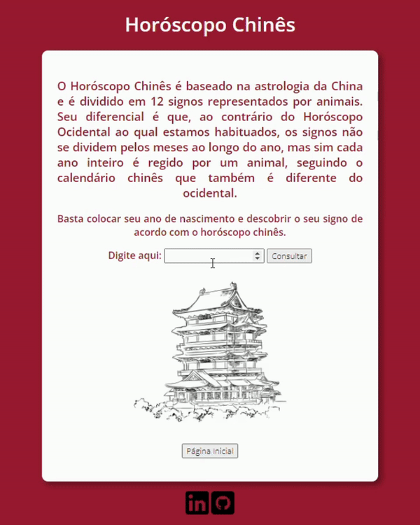

# Página de consulta do **Horóscopo Chinês** 🐲

Este projeto é uma página web que fornece informações sobre o **Horóscopo Chinês**, permitindo ao usuário inserir o ano de nascimento para descobrir o seu signo chinês.

## Recursos

A página web possui elementos de ***JavaScript*** e ***CSS*** para proporcionar uma interface amigável, providenciando um container no meio da página que muda de acordo com o ano inserido.

## Forma de uso

Para que o usuário possa verificar as informações contidas na página web, há um campo de consulta onde o mesmo deve inserir o ano que deseja visualizar o **signo chinês** e um botão de página inicial para retornar a tela de ínicio e inserir um ano de busca novamente.

### Estrutura dos arquivos
- `index.html`: Página principal em HTML que contém as referências em ***CSS e Javascript*** para que a interface seja amigável e funcional.
- `signos.css`: Arquivo responsável pelo estilo da página principal, contém as informações das cores de fundo, da fonte e do container da página.
- `signos.js`: Arquivo responsável pela estrutura lógica da página, analisando a resposta inserida pelo usuário e decidindo qual imagem do signo do horóscopo será apresentada baseada na informação armazenada.
- `pasta/img`: Diretório que contém as imagens que estão em referência no arquivo ***javascript***.

## Esquema de dados

- `Entrada`: Obtém o **ano informado** pelo usuário através da página HTML inicial.

- `Lógica`: Calcula o resto da divisão desse ano por **12**.

- `Estrutura`: Cada signo é associado a um número de 0 a 11, que é obtido através do cálculo do resto da divisão do ano por 12.

- `Resultado`: Com base no resultado do cálculo, exibe o nome do animal, a imagem e a descrição do signo correspondente.

## Conhecimentos Técnicos

- Construir estrutura da página inicial em ***HTML***.
- Referenciar o estilo da página como: Cores de fonte, fundo e imagens com ***CSS***.
- Estruturar a lógica com ***Javascript***.
- Realizar *upload* em servidor local ou online.

<small><i>**Figura** **1: Imagem animada da página inicial funcionando.**</i></small>